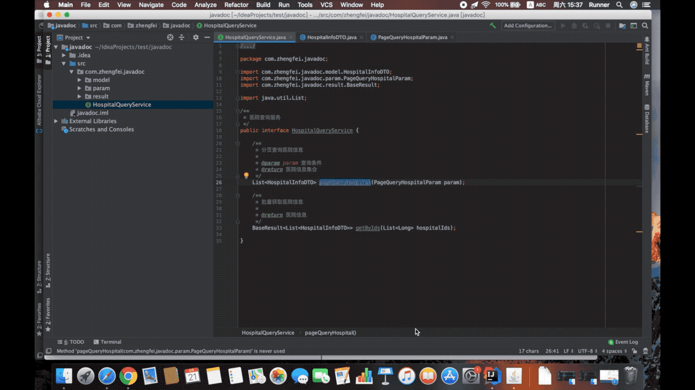

# Generate Document plugin for IntelliJ platform IDEs

## What is generate-document?
Java code comments automatically converts user-defined template documents

## Features

* Support for generating spring rest documents
* Support for user-defined document template settings
* Support to generate Er graph of database table
* User-defined methods/field filtering
* User-defined annotation extraction method description or field description
* Single method to generate a document
* Single class generation document

## Install

[Download](https://plugins.jetbrains.com/plugin/13086-generate-document/versions)

## Demo

[Spring REST supports annotation demo](demo/spring-rest.md)

[Spring REST demo](demo/spring-rest-employee.md)

[Interface demo](demo/interface.md)

## What’s New

* 2.3
    *  Support for generating spring rest documents
    *  Support to generate Er graph of database table
    *  Add markdown template
    *  Support document saving to file
    *  Other known issues to fix optimization
    
* 2.2
    *  Template editing adds variable descriptions for user-friendly templates
    *  Support internationalization, temporarily only support Chinese and English
    *  Fix template preview page mouse cannot scroll
    *  Setting page with the same name data can not be saved
    *  Other known issues to fix optimization
    
* 2.1
    *  Support for user-defined document template settings
    *  Support user-defined methods/field filtering
    *  Support user-defined annotation extraction field description
    *  Support for generating a document with a single method name
    *  Fix circular dependency class memory overflow
    *  User experience optimization
    *  bugfix

## Use

## Feedback
If you have any questions during use, please feel free to contact me. You can use the following contact information to communicate with me.

* email: (657812595#qq.com, #replace@)
* QQ: 657812595
