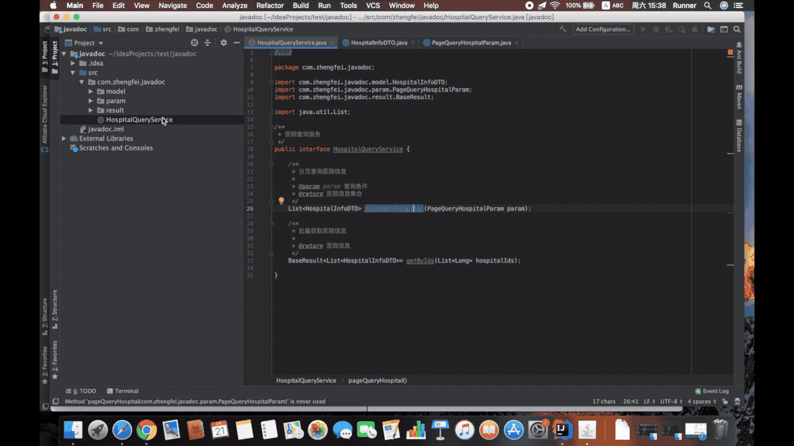
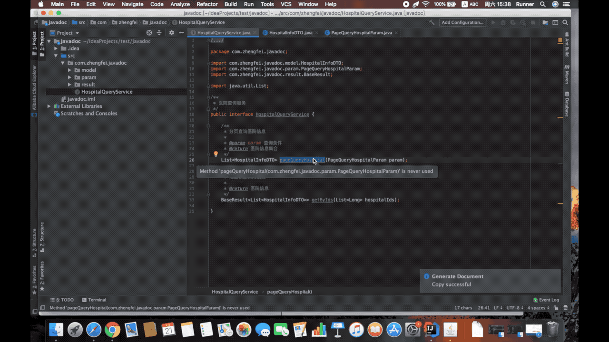

# Generate Document plugin for IntelliJ platform IDEs

## What is generate-document?
Java code comments automatically converts user-defined template documents

## Features

* Support for generating spring rest documents
* Support for user-defined document template settings
* Support to generate Er graph of database table
* User-defined methods/field filtering
* User-defined annotation extraction method description or field description
* Single method to generate a document
* Single class generation document

## Install

[Download](https://plugins.jetbrains.com/plugin/13086-generate-document/versions)

## Demo

[Spring REST supports annotation demo](demo/spring-rest.md)

[Spring REST demo](demo/spring-rest-employee.md)

[Interface demo](demo/interface.md)

[Table ER](demo/sql-er.md)

## What’s New

### Version 2022.1

#### English
- Fixed compatibility issues for the new version
- REST template support ${contentType}/${pathParams}/${queryParams}/${requestBodyParams}/${curlExample}
- Fix some project #projectVersion() not getting the problem
- Support time formatting configuration parsing
- Html template rewriting

#### Chinese
- 修复了新版本的兼容性问题
- REST模版支持${contentType}/${pathParams}/${queryParams}/${requestBodyParams}/${curlExample}
- 修复部分项目#projectVersion()获取不到问题
- 支持时间格式化配置解析
- Html模版重写

### Version 2021.1

#### English
- Template supports the include/parse of other templates
- Added Html template
- Support @Deprecated annotation
- Support @author annotation mark
- Support HttpEntity/RequestEntity/ResponseEntity/DeferredResult/WebAsyncTask/CompletableFuture class resolution

#### Chinese
- 支持HttpEntity/RequestEntity/ResponseEntity/DeferredResult/WebAsyncTask/CompletableFuture等类解析
- 模版支持引入其他模版
- 新增Html模版
- 支持@Deprecated注解
- 支持@author注释标
- 注解/字段变量支持解析（例如：@GetMapping(ApiVersion.ADMIN_ROOT+"/testConstants/" + ApiVersion.VERSION)/private int orderId = 11;）

## Use

## Feedback
If you have any questions during use, please feel free to contact me. You can use the following contact information to communicate with me.

* email: (657812595#qq.com, #replace@)
* QQ: 657812595
