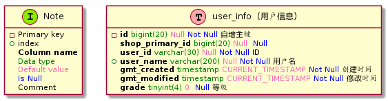

## PlanUML code
```
@startuml
!define Table(name,desc) class name as "desc" << (T,#FFAAAA) >>
!define Info(name) class name << (I,#8CEA00) >>
!define column_type(x) <color:green>x</color>
!define column_is_not_null(x) <color:blue>x</color>
!define column_default_val(x) <color:hotpink>x</color>
!define column(x) <b>x</b>
hide methods
hide stereotypes
Info(Note){
    -Primary key
    +index
    <b>Column name</b>
    <color:green>Data type</color>
    <color:hotpink>Default value</color>
    <color:blue>Is Null</color>
    Comment
}

Table(user_info, "user_info  (用户信息)") {
    -{field} column(id) column_type(bigint(20)) column_default_val( Null) column_is_not_null(Not Null) 自增主键
    {field} column(shop_primary_id) column_type(bigint(20)) column_default_val( Null)  column_is_not_null(Null) 
    {field} column(user_id) column_type(varchar(30)) column_default_val( Null) column_is_not_null(Not Null) ID
    +{field} column(user_name) column_type(varchar(200)) column_default_val( Null) column_is_not_null(Not Null) 用户名
    {field} column(gmt_created) column_type(timestamp) column_default_val(CURRENT_TIMESTAMP) column_is_not_null(Not Null) 创建时间
    {field} column(gmt_modified) column_type(timestamp) column_default_val(CURRENT_TIMESTAMP) column_is_not_null(Not Null) 修改时间
    {field} column(grade) column_type(tinyint(4)) column_default_val(0)  column_is_not_null(Null) 等级
}
@enduml
```

